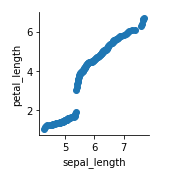
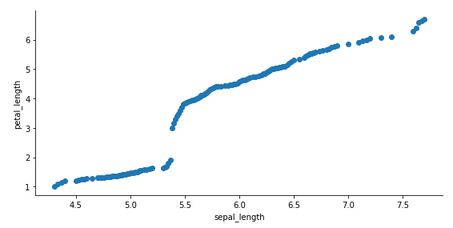
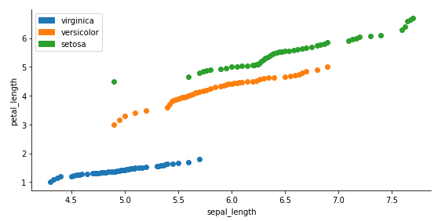

==============
seaborn-qqplot
==============

.. module:: seaborn-qqplot

**seaborn-qqplot** is a seaborn extension adding qqplots.

User's Guide
============

Requirements
------------

seaborn-qqplot is build on top of the following libraries:

* `Numpy` (http://www.numpy.org)
* `SciPy` (http://www.scipy.org)
* `Pandas` (http://pandas.pydata.org/)
* `matplotlib` (http://http://matplotlib.org/)

Issues
------

Should you encounter any issue with the library you can raise them here: https://github.com/ronsenbergVI/seaborn-qqplot/issues

.. include:: ../INSTALL.rst

Quickstart
==========

A simple qq-plot comparing the iris dataset petal length and sepal length distributions
can be done as follows:

  >>> import seaborn_qqplot as sqp
  >>> import seaborn as sns
  >>> iris = sns.load_dataset('iris')
  >>> qqplot(iris, x="petal_length", y="sepal_length")

   simple qqplot

The sizes can be changed with the height and aspect parameters. The height can be fixed directly
and the aspect will set the width in relation to the height:

  >>> qqplot(iris, x="sepal_length", y="petal_length", height = 4, aspect = 1.5)

   simple qqplot - size altered

While performing exploratory data analysis (seaborn had become quite popular to perform such
taks), it is very informative to display the change in the underlying distribution of a variable
for a given label:

  >>> qqplot(iris, x="sepal_length", y="petal_length", hue = "species", height = 4, aspect = 1.5)

   qqplot with hue

seaborn qqplot also allows to compare a variable to a known probability distribution. The extension
only supports `scipy.rv_continuous` random variable models:

  >>> from scipy.stats import gamma
  >>> qqplot(iris, x="sepal_length", y=gamma, hue = "species", height = 4, aspect = 1.5)

  .. figure::  images/fig4.png
     :align:   center

     gamma qqplot for the sepal_length variable

A qqplot with 2 samples from the same distribution will display points close to the x=y line
thus it is possible to add the identity line as a graphical diagnostic:

  >>> qqplot(iris, x="sepal_length", y=gamma, hue = "species", height = 4, aspect = 1.5, display_kws={"identity":True})

  .. figure::  images/fig5.png
     :align:   center

     gamma qqplot for the sepal_length variable with identity line

Seaborn-qqplot Changelog
=========================

We detail here the changes made to the library

.. include:: ../CHANGES

License
=======

seaborn-qqplot is licensed under the BSD 3-Clause License.
It means that the source code provided in the binaries can be used, modified,
or distributed freely for commercial or personal use with conditions only
requiring preservation of copyright and license notices.

The full license text can be found below (:ref:`seaborn-qqplot-license`).

Authors
-------

.. include:: ../AUTHORS

Contributing
------------

.. include:: ../CONTRIBUTING

License Definitions
-------------------

The following section contains the full license texts for seaborn-qqplot and the
documentation.

-   "AUTHORS" hereby refers to all the authors listed in the
    :ref:`authors` section.

-   The ":ref:`seaborn-qqplot-license`" applies to all the source code shipped as
    part of seaborn-qqplot (seaborn-qqplot itself as well as the examples and the unittests)
    as well as documentation.

.. seaborn-qqplot-license:

seaborn-qqplot License
----------------------

.. include:: ../LICENSE
